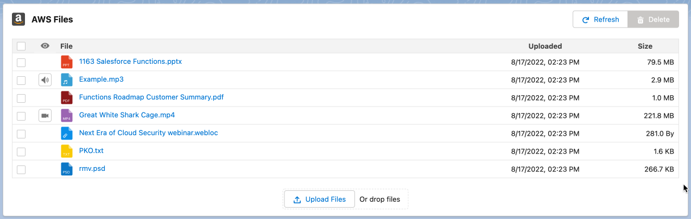
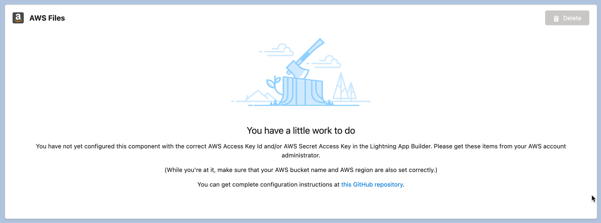
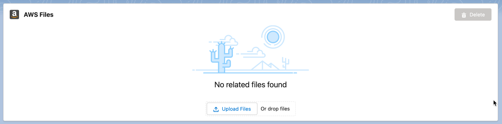
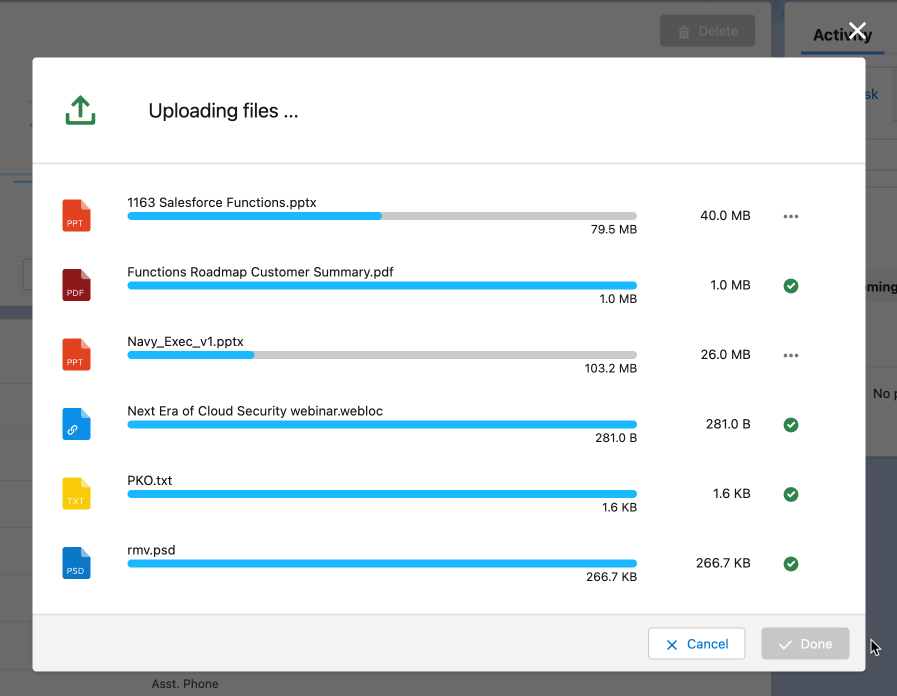
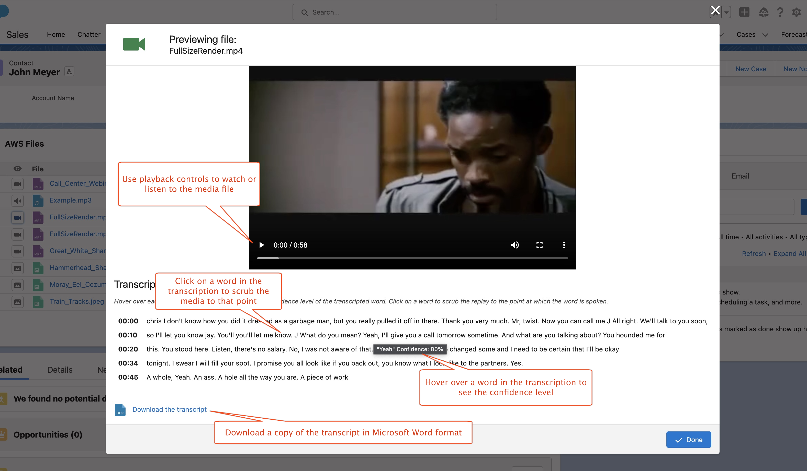
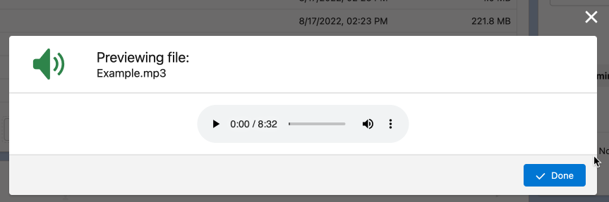

 

<h1 align="center">AWS S3 MEDIA FILES</h1>

This package contains Lightning components and other support to demo Salesforce connectivity to <a href="https://aws.amazon.com">Amazon Web Services</a> (AWS) <a href="https://aws.amazon.com/aws/s3">S3 File Storage</a>, along with audio and video file transcription and redaction and JPEG EXIF metadata extraction.

## Summary

This component implements a browser-only file management capability to display AWS S3 buckets on Salesforce record and app pages and perform transcription and redaction on media (video and audio) files. When used on a Salesforce record page, the component reports only those objects in the S3 bucket prefixed by the record Id of the displayed record. The administrator must configure an additional prefix in case multiple demos are being conducted using the same S3 bucket so that they do not interfere with one another.

The package uses the [AWS SDK for Javascript](https://docs.aws.amazon.com/sdk-for-javascript/v2/developer-guide/welcome.html) in the browser to communicate directly with S3. This is useful, for example, for customers who cannot use Salesforce-based S3 connectivity solutions for compliance or other reasons.

## Installation and Setup of the Salesforce Components

Read the disclaimer below and click on the **Install the Package** link. This will install all the components and other metadata to your Salesforce org.

Once the package is deployed, you will need to create a Lightning app or record page with the Lightning App Builder and drag the `AWS S3 Media Files` custom component on the page where you would like to place it. If you have used SFDX to create a scratch org using the scripts in this repo, a Lightning record page for the Contact object called `AWS S3 Test Record Page` is already in the scratch org and just needs to be activated.

Once on the component is dragged on the page in Lightning App Builder, it will be unconfigured and display the following graphic:

To configure the component, you will need four pieces of information for authentication purposes, which you can get from your AWS administrator:

- The name of the AWS bucket
- The AWS region in which the bucket resides
- The AWS access key ID for the account
- The AWS secret access key for the account

You will also need to choose a unique demo prefix, which will serve as a folder under the main bucket where you will keep all of your files, transcriptions, and redactions. This is to make sure that the AWS administrator can identify and remove any old files that are no longer needed for demo purposes. The name must contain no whitespace characters, and should be descriptive of the use case; for example, "MeyersIRSDemo2023".

Once configured, the component will show that no files exist yet:

To upload a file or set of files, click the `Upload Files` button or drag the files from your desktop to the drop area. An upload modal will then appear showing the progress of the uploads:

## Media File Playback

If a file is a video file, a button will appear on the left of the file list that will bring up a modal allowing the user to view the video file:

If the file is an audio file, the user can push the audio button to listen to the audio:

## Caveats and Known Limitations

- The authentication information (access key Id and secret access key) are entered in the configuration metadata for easy entry by Salesforce solution engineers using Lightning App Builder to demo this capability. A customer would never expose this sensitive information in a production environment, preferring to store this information in a named credential or by authenticating to AWS using SSO or some other more sophisticated mechanism. We leave such an implementation to the customer or to the customer's systems integrator and hope that the rest of this code can be useful to that effort.
- In the same vein, the component uses the SDK's `getSignedUrl` method to create a time-sensitive link to the object in the S3 bucket when displaying the file list. This URL contains the AWS access key Id. A production environment will want to use an appropriate authentication method to reference these S3 objects.

## Troubleshooting

- I have experienced problems with this component if the user has Debug Mode turned on. Turn Debug Mode off and see if that clears things up.

## How to Deploy This Package to Your Org

I am a pre-sales Solutions Engineer for [Salesforce](https://www.salesforce.com) and I develop solutions for my customers to demonstrate the capabilities of the amazing Salesforce platform. _This package represents functionality that I have used for demonstration purposes and the content herein is definitely not ready for actual production use; specifically, it has not been tested extensively nor has it been written with security and access controls in mind. By installing this package, you assume all risk for any consequences and agree not to hold me or my company liable._ If you are OK with that ...

[Install the Package in Production](https://login.salesforce.com/packaging/installPackage.apexp?p0=04t2E000003smq0QAA)
[Install the Package in a Sandbox](https://test.salesforce.com/packaging/installPackage.apexp?p0=04t2E000003smq0QAA)

## Maintainer

John Meyer, Salesforce Solution Engineer

**Current Version**: 1.0.0
